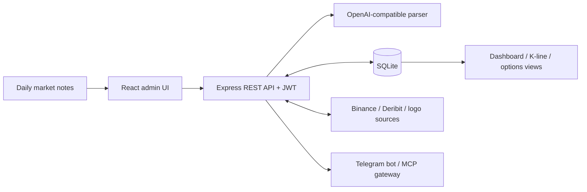

<div align="center">

# Crypto Metrics Dashboard

**A self-hosted workspace for structuring daily crypto market notes, tracking market signals, and exploring options scenarios.**

[English](README.md) · [简体中文](README.zh-CN.md)

[](https://github.com/Linon419/crypto-metrics-dashboard/actions/workflows/docker-image.yml)
[](https://nodejs.org/)
[](https://react.dev/)
[](https://www.sqlite.org/)

</div>

Crypto Metrics Dashboard combines a React interface, an Express API, SQLite persistence, and an OpenAI-compatible parsing service. It turns unstructured daily market text into queryable metrics and provides dashboards for OTC signals, liquidity, market phases, volatility, K-line data, and BTC options.

The project supports local-first operation, development workflows, Docker deployment, Windows/macOS launchers, Telegram notifications, and an HTTP MCP gateway.

> [!IMPORTANT]
> This project is designed for research and operational monitoring. Independently verify all data and analysis before making investment decisions.

## Table of contents

- [Highlights](#highlights)
- [Architecture](#architecture)
- [Technology stack](#technology-stack)
- [Quick start](#quick-start)
- [Configuration](#configuration)
- [Data and backups](#data-and-backups)
- [API and integrations](#api-and-integrations)
- [Docker deployment](#docker-deployment)
- [Project structure](#project-structure)
- [Development](#development)
- [Security](#security)
- [Contributing](#contributing)
- [License](#license)

## Highlights

- **AI-assisted ingestion** — Parse daily market notes into normalized JSON through OpenAI or a compatible API provider.
- **Market signal dashboard** — Track OTC and liquidation indexes, entry/exit phases, momentum markers, Schelling price points, and historical changes.
- **Liquidity monitoring** — Record BTC, ETH, SOL, and total-market fund flows with daily commentary.
- **Options workspace** — Inspect BTC volatility, strategy blueprints, live Deribit option data, scenario Greeks, and payoff curves.
- **K-line pipeline** — Configure symbol mappings, backfill and clean candles, stream Binance updates over WebSocket, and render historical charts.
- **Operations console** — Manage users, tracked assets, timestamps, parsing prompts, database patches, and application settings.
- **Portable data** — Export and import JSON snapshots, back up SQLite directly, or create launcher bundles with a database included.
- **Integration endpoints** — Connect through the Telegram bot or the authenticated HTTP MCP gateway.
- **Automatic asset logos** — Resolve, cache, and serve logos with provider-backed and generated fallbacks.

## Architecture



| Layer | Implementation | Responsibility |
| --- | --- | --- |
| Web client | React, Redux Toolkit, Ant Design, ECharts, Plotly | Data entry, dashboards, administration, interactive charts |
| API | Express, JWT, Sequelize | Authentication, parsing, validation, persistence, data management |
| Storage | SQLite | Users, assets, metrics, liquidity, options tuning, K-line data, settings |
| Market adapters | Binance, Deribit, configurable logo providers | Candles, live streams, BTC volatility, option-chain enrichment, logos |
| Integrations | Telegram Bot, HTTP JSON-RPC MCP gateway | Notifications and programmatic access |
| Distribution | Docker, Windows/macOS launchers | Self-hosting and local one-click operation |

## Technology stack

| Area | Main technologies |
| --- | --- |
| Frontend | React 19, React Router, Redux Toolkit, Ant Design |
| Visualization | ECharts, Recharts, Plotly, Lightweight Charts |
| Backend | Node.js, Express, Sequelize |
| Database | SQLite |
| AI parsing | OpenAI Node SDK with configurable base URL and model |
| Real-time data | WebSocket, Binance market streams |
| Packaging | Docker Compose, multi-architecture GHCR image, local launcher bundles |

## Quick start

### Option 1: local launcher

This path builds the frontend, starts the API and browser, and keeps all data on the local machine.

Requirements:

- Node.js 18 or a newer LTS release
- npm

```bash
git clone https://github.com/Linon419/crypto-metrics-dashboard.git
cd crypto-metrics-dashboard
cp .env.example .env
node scripts/start-local-dashboard.js
```

Open <http://localhost:3001>. The launcher also opens this address automatically.

For a new local database created from `.env.example`, use:

```text
Username: admin
Password: 123456
```

> [!CAUTION]
> `123456` is a development-only sample credential. Set a unique strong `ADMIN_PASSWORD` before the first launch of every shared or production instance, or change the password immediately after the first local sign-in.

AI parsing becomes available after `OPENAI_API_KEY` is configured; dashboards and local data management remain available through the launcher with an empty key.

Platform launchers are also available:

- Windows: `launchers/windows/Start Crypto Dashboard.bat`
- macOS: `launchers/mac/Start Crypto Dashboard.command`

See [Local launcher documentation](launchers/README.md) for packaging and platform notes.

### Option 2: development mode

Install the web and server dependencies, then configure the root environment file:

```bash
npm install
npm --prefix server install
cp .env.example .env
```

Set a usable `OPENAI_API_KEY` in `.env`. The `npm run server` preflight checks this value before starting the backend.

```bash
npm run dev
```

| Service | URL |
| --- | --- |
| React development server | <http://localhost:3000> |
| Express API | <http://localhost:3001> |
| Health check | <http://localhost:3001/api/test> |
| API documentation | <http://localhost:3001/api/docs/html> |

## Configuration

Copy `.env.example` to `.env` for local operation. Production templates live under `deploy/docker/`.

### Core server settings

| Variable | Required | Purpose | Example |
| --- | --- | --- | --- |
| `NODE_ENV` | Production | Runtime mode | `production` |
| `PORT` | Optional | API listening port | `3001` |
| `API_PUBLIC_HOST` | Yes | Public origin used to generate the frontend runtime API URL; omit the `/api` suffix | `https://metrics.example.com` |
| `DB_STORAGE` | Optional | SQLite database path | `./database.sqlite` |
| `JWT_SECRET` | Yes in production | JWT signing secret; production startup requires at least 32 characters | Random 32+ character value |
| `ADMIN_USERNAME` | First run | Initial administrator username | `admin` |
| `ADMIN_EMAIL` | First run | Initial administrator email | `admin@example.com` |
| `ADMIN_PASSWORD` | First run | Initial administrator password | Strong unique password |
| `DEV_AUTH_BYPASS` | Development only | Explicit local authentication bypass | `true` |

When `ADMIN_PASSWORD` is absent, the server generates a strong password and writes it once to the startup log. Save it before the log is rotated.

### AI parsing

| Variable | Required | Purpose | Default |
| --- | --- | --- | --- |
| `OPENAI_API_KEY` | For AI ingestion | API credential | — |
| `OPENAI_BASE_URL` | Optional | OpenAI-compatible API base URL | `https://api.openai.com/v1` |
| `OPENAI_MODEL` | Optional | Parsing model | `gpt-4o` |
| `OPENAI_SYSTEM_PROMPT` | Optional | System prompt override | Built-in prompt |
| `OPENAI_PROMPT` | Optional | User prompt template containing `{{processedText}}` | Built-in template |

Prompt rules can also be maintained from **Admin → AI Parsing Prompt**. See [OpenAI configuration](docs/deployment/openai-config.md) for provider examples.

### Optional integrations

| Variable | Integration | Purpose |
| --- | --- | --- |
| `BRANDFETCH_CLIENT_ID` | Asset logos | Browser-side official logo lookup |
| `LOGO_CACHE_DIR` | Asset logos | Server-side logo cache directory |
| `TELEGRAM_BOT_TOKEN` | Telegram | Bot token |
| `API_BASE_URL` | Telegram | Dashboard API base URL |
| `ADMIN_CHAT_IDS` | Telegram | Comma-separated administrator chat IDs |
| `MCP_GATEWAY_TOKEN` | MCP | Bearer token protecting the gateway |
| `CRYPTO_API_BASE_URL` | MCP | Internal dashboard API URL |
| `CRYPTO_DEFAULT_USERNAME` | MCP | Optional automatic backend login |
| `CRYPTO_DEFAULT_PASSWORD` | MCP | Optional automatic backend login |
| `TZ` | Server and bot | Runtime timezone |

## Data and backups

SQLite is the default persistence layer. Sequelize synchronizes the schema during server startup.

| Data domain | Main models |
| --- | --- |
| Assets and mappings | `Coins`, `CoinKlineMappings` |
| Daily signals | `DailyMetrics`, `TrendingCoins` |
| Liquidity | `LiquidityOverviews` |
| Options tuning | `OptionTunings` |
| Candles and price points | `CoinKlines`, `BtcPricePoints` |
| Access and preferences | `Users`, `UserFavorites`, `AppSettings` |

Backup options:

1. Export a JSON snapshot from the administration interface or `GET /api/data/export-all`.
2. Copy the SQLite file configured by `DB_STORAGE` while the service is stopped or through a SQLite-safe backup procedure.
3. Build a local distribution bundle containing the current root `database.sqlite` with `npm run build:launchers:with-data`.

Restore JSON snapshots through the administration interface or `POST /api/data/import-database`. Validate backups in a separate environment before production restoration.

Bundles created with `build:launchers:with-data` contain the complete database, including user records and password hashes. Handle them as sensitive backup artifacts.

## API and integrations

Interactive HTML documentation is served from `/api/docs/html`; the JSON definition is available at `/api/docs`.

| Access | Method | Endpoint | Purpose |
| --- | --- | --- | --- |
| Public | `GET` | `/api/test` | Health check |
| Public | `GET` | `/api/public/top-otc-crypto` | Latest top OTC assets |
| Public | `GET` | `/api/public/bottom-otc-crypto` | Latest bottom OTC assets |
| Public | `GET` | `/api/logos/:symbol` | Cached or generated asset logo |
| Authentication | `POST` | `/api/auth/login` | Obtain a JWT |
| Authenticated | `POST` | `/api/data/input` | Parse and persist source text |
| Authenticated | `GET` | `/api/data/latest` | Read the latest structured metrics |
| Authenticated | `GET` | `/api/data/export-all` | Export a JSON snapshot |
| Authenticated | `POST` | `/api/data/import-database` | Import a JSON snapshot |
| Authenticated | `GET` | `/api/volatility/btc` | BTC realized/implied volatility snapshot |
| Authenticated | `GET` | `/api/options/btc/chain` | BTC option chain |
| WebSocket | — | `/ws/klines?symbol=BTC&interval=1d` | Live K-line updates |

Protected REST endpoints expect:

```http
Authorization: Bearer <jwt>
```

### Telegram bot

```bash
npm --prefix telegram-bot install
npm run bot
```

Configure `TELEGRAM_BOT_TOKEN`, `API_BASE_URL`, and `ADMIN_CHAT_IDS`. The complete template is available at [`telegram-bot/.env.example`](telegram-bot/.env.example).

### MCP gateway

The HTTP JSON-RPC gateway is mounted at:

```text
POST /default/crypto/mcp
```

Every gateway request requires:

```http
Authorization: Bearer <MCP_GATEWAY_TOKEN>
```

Optional `Mcp-Session-Id` headers preserve the backend JWT session for 30 minutes. Gateway manifests and the design note are available under [`deploy/mcp/`](deploy/mcp/) and [MCP gateway design](docs/plans/2026-01-14-mcp-gateway-design.md).

## Docker deployment

The repository publishes `linux/amd64` and `linux/arm64` images to GitHub Container Registry through GitHub Actions.

Prepare the production template:

```bash
cp deploy/docker/.env.example deploy/docker/.env
```

Set strong production secrets, then review `API_PUBLIC_HOST` and the host volume path in `deploy/docker/docker-compose.prod.yml` for the target server.

```bash
docker compose \
  --env-file deploy/docker/.env \
  -f deploy/docker/docker-compose.prod.yml \
  up -d
```

The included template exposes the application on port `3080` and persists SQLite under `/data/db` inside the container. See [Server deployment](docs/deployment/server-deployment.md) for operational notes.

## Project structure

```text
.
├── public/                  # Static web assets
├── src/                     # React application
│   ├── components/          # Dashboard, options, and admin UI
│   ├── redux/               # Client state
│   ├── services/            # API and WebSocket client
│   └── utils/               # Formatting and domain logic
├── server/                  # Express API
│   ├── middleware/          # Authentication and first-run setup
│   ├── models/              # Sequelize models
│   ├── routes/              # REST API and MCP gateway
│   ├── services/            # AI and WebSocket services
│   └── utils/               # Market adapters and domain logic
├── telegram-bot/            # Telegram notification bot
├── launchers/               # Windows and macOS launchers
├── scripts/                 # Build and local distribution scripts
├── deploy/                  # Docker and MCP deployment manifests
├── docs/                    # Deployment, design, and maintenance docs
├── Dockerfile
└── docker-compose.yml
```

## Development

### Commands

| Command | Description |
| --- | --- |
| `npm start` | Start the React development server |
| `npm run server` | Start the Express API through the root preflight script |
| `npm run dev` | Start the frontend and API together |
| `npm run dev-full` | Start the frontend, API, and Telegram bot |
| `npm run build` | Create a production frontend build |
| `npm test` | Run the React test suite |
| `npm run build:launchers` | Build local launcher packages |
| `npm run build:launchers:with-data` | Build launcher packages with `database.sqlite` |

The backend also contains focused Node test scripts under `server/tests/`. Run a specific test directly, for example:

```bash
node server/tests/optionsPayoff.test.js
node server/tests/klineWebSocket.test.js
```

### Launcher packages

```bash
npm run build:launchers
npm run build:launchers:with-data
```

Artifacts are written to `local-artifacts/launchers/` as folders and ZIP archives.

## Security

- Generate unique values for `JWT_SECRET`, `ADMIN_PASSWORD`, and `MCP_GATEWAY_TOKEN` in every deployment.
- Store API keys in `.env` files or a secret manager. The repository ignores environment files and runtime databases.
- Use HTTPS through a reverse proxy for internet-facing deployments.
- Restrict file permissions for the SQLite database, backups, logs, and logo cache.
- Keep `DEV_AUTH_BYPASS` scoped to local development.
- Review public registration and administrator settings before exposing the service.
- Rotate the sample local administrator password during the first session.

Please report security-sensitive findings privately to the repository owner through their [GitHub profile](https://github.com/Linon419).

## Contributing

Issues and pull requests are welcome. A focused contribution flow keeps changes reviewable:

1. Open an issue describing the problem, expected behavior, and reproduction context.
2. Create a topic branch from `main`.
3. Add tests for behavior changes and run the directly relevant checks.
4. Use a Conventional Commit-style message such as `fix(api): correct option payoff validation`.
5. Open a pull request with scope, validation evidence, configuration impact, and screenshots for UI changes.

Keep generated databases, credentials, logs, local artifacts, and provider responses outside commits.

## License

Licensing status is currently pending: the repository has no root `LICENSE` file. Review reuse and distribution terms with the repository owner until an explicit license is published. An OSI-approved license should accompany any formal open-source release.
