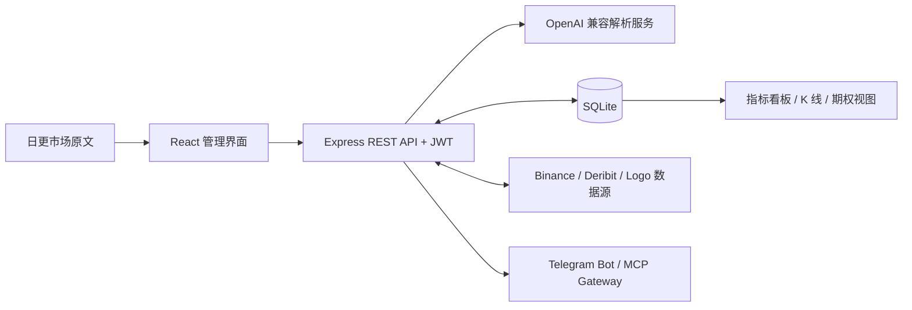

<div align="center">

# Crypto Metrics Dashboard

**一套用于结构化日常加密市场原文、追踪市场信号与分析期权情景的自托管工作台。**

[English](README.md) · [简体中文](README.zh-CN.md)

[](https://github.com/Linon419/crypto-metrics-dashboard/actions/workflows/docker-image.yml)
[](https://nodejs.org/)
[](https://react.dev/)
[](https://www.sqlite.org/)

</div>

Crypto Metrics Dashboard 由 React 界面、Express API、SQLite 持久化与 OpenAI 兼容解析服务组成。系统将非结构化的日更市场原文转换为可查询指标，并提供场外信号、流动性、市场阶段、波动率、K 线和 BTC 期权分析看板。

项目支持本地优先运行、开发调试、Docker 部署、Windows/macOS 启动器、Telegram 通知和 HTTP MCP Gateway。

> [!IMPORTANT]
> 本项目用于研究与运营监控。任何投资决策都应建立在独立数据核验与风险评估之上。

## 目录

- [核心能力](#核心能力)
- [系统架构](#系统架构)
- [技术栈](#技术栈)
- [快速开始](#快速开始)
- [配置](#配置)
- [数据与备份](#数据与备份)
- [API 与集成](#api-与集成)
- [Docker 部署](#docker-部署)
- [项目结构](#项目结构)
- [开发指南](#开发指南)
- [安全建议](#安全建议)
- [参与贡献](#参与贡献)
- [许可证](#许可证)

## 核心能力

- **AI 辅助录入**：通过 OpenAI 或兼容 API 将日更市场原文解析为规范化 JSON。
- **市场信号看板**：追踪场外指数、爆破指数、进退场阶段、动能标记、谢林点位和历史变化。
- **流动性监控**：记录 BTC、ETH、SOL 与全市场资金变化及每日备注。
- **期权工作台**：分析 BTC 波动率、策略模板、Deribit 实时期权数据、情景 Greeks 与收益曲线。
- **K 线管线**：配置标的映射、回补与清理数据，通过 WebSocket 接收 Binance 更新并展示历史图表。
- **运营管理台**：管理用户、标的、时间记录、解析 Prompt、数据库补丁与应用设置。
- **便携数据管理**：导出和导入 JSON 快照、直接备份 SQLite，或生成携带数据库的启动器分发包。
- **集成接口**：通过 Telegram Bot 或带鉴权的 HTTP MCP Gateway 接入。
- **自动标的 Logo**：从外部来源解析并缓存 Logo，同时提供自动生成的回退图标。

## 系统架构



| 层级 | 实现 | 职责 |
| --- | --- | --- |
| Web 客户端 | React、Redux Toolkit、Ant Design、ECharts、Plotly | 数据录入、指标看板、管理后台、交互图表 |
| API | Express、JWT、Sequelize | 鉴权、解析、校验、持久化、数据管理 |
| 存储 | SQLite | 用户、标的、指标、流动性、期权调参、K 线、应用设置 |
| 市场适配器 | Binance、Deribit、可配置 Logo 来源 | K 线、实时流、BTC 波动率、期权链增强、Logo |
| 集成 | Telegram Bot、HTTP JSON-RPC MCP Gateway | 消息通知与程序化访问 |
| 分发 | Docker、Windows/macOS 启动器 | 自托管与本地一键运行 |

## 技术栈

| 领域 | 主要技术 |
| --- | --- |
| 前端 | React 19、React Router、Redux Toolkit、Ant Design |
| 可视化 | ECharts、Recharts、Plotly、Lightweight Charts |
| 后端 | Node.js、Express、Sequelize |
| 数据库 | SQLite |
| AI 解析 | OpenAI Node SDK，可配置 Base URL 与模型 |
| 实时数据 | WebSocket、Binance 市场数据流 |
| 打包部署 | Docker Compose、多架构 GHCR 镜像、本地启动器分发包 |

## 快速开始

### 方式一：本地启动器

该方式会构建前端、启动 API 与浏览器，并将数据保存在本机。

环境要求：

- Node.js 18 或更新的 LTS 版本
- npm

```bash
git clone https://github.com/Linon419/crypto-metrics-dashboard.git
cd crypto-metrics-dashboard
cp .env.example .env
node scripts/start-local-dashboard.js
```

访问 <http://localhost:3001>。启动器也会自动打开该地址。

使用 `.env.example` 创建全新本地数据库时，初始账号为：

```text
用户名：admin
密码：123456
```

> [!CAUTION]
> `123456` 仅用于本地开发示例。共享实例与生产实例应在首次启动前配置独立强 `ADMIN_PASSWORD`；本地首次登录后也应立即修改密码。

配置 `OPENAI_API_KEY` 后即可使用 AI 解析；密钥为空时，本地启动器仍可用于看板浏览与本地数据管理。

项目还提供平台启动入口：

- Windows：`launchers/windows/Start Crypto Dashboard.bat`
- macOS：`launchers/mac/Start Crypto Dashboard.command`

分发包构建与平台说明见[本地启动器文档](launchers/README.md)。

### 方式二：开发模式

安装 Web 与服务端依赖，然后配置根目录环境文件：

```bash
npm install
npm --prefix server install
cp .env.example .env
```

可在 `.env` 中填写 AI API Key，也可以先启动后端，再通过 **管理后台 → AI 模型** 完成配置。

```bash
npm run dev
```

| 服务 | 地址 |
| --- | --- |
| React 开发服务器 | <http://localhost:3000> |
| Express API | <http://localhost:3001> |
| 健康检查 | <http://localhost:3001/api/test> |
| API 文档 | <http://localhost:3001/api/docs/html> |

## 配置

本地运行时，将 `.env.example` 复制为 `.env`。生产环境模板位于 `deploy/docker/`。

### 后端核心配置

| 变量 | 必需条件 | 用途 | 示例 |
| --- | --- | --- | --- |
| `NODE_ENV` | 生产环境 | 运行模式 | `production` |
| `PORT` | 可选 | API 监听端口 | `3001` |
| `API_PUBLIC_HOST` | 必需 | 生成前端运行时 API 地址的公开 Origin，请省略 `/api` 后缀 | `https://metrics.example.com` |
| `DB_STORAGE` | 可选 | SQLite 数据库路径 | `./database.sqlite` |
| `JWT_SECRET` | 生产环境必需 | JWT 签名密钥，生产启动要求至少 32 个字符 | 32 位以上随机值 |
| `ADMIN_USERNAME` | 首次运行 | 初始管理员用户名 | `admin` |
| `ADMIN_EMAIL` | 首次运行 | 初始管理员邮箱 | `admin@example.com` |
| `ADMIN_PASSWORD` | 首次运行 | 初始管理员密码 | 独立强密码 |
| `DEV_AUTH_BYPASS` | 仅开发环境 | 显式开启本地鉴权绕过 | `true` |

未配置 `ADMIN_PASSWORD` 时，服务端会生成强随机密码，并在首次启动日志中输出一次。请在日志轮转前保存。

### AI 解析配置

| 变量 | 必需条件 | 用途 | 默认值 |
| --- | --- | --- | --- |
| `OPENAI_PROVIDER` | 可选 | 回退供应商：`openai`、`deepseek` 或 `custom` | 根据 Base URL 推断，随后使用 `openai` |
| `OPENAI_API_KEY` | 使用 AI 录入时 | API 凭证 | — |
| `DEEPSEEK_API_KEY` | 可选 | DeepSeek 凭证，可回退使用 `OPENAI_API_KEY` | — |
| `OPENAI_BASE_URL` | 可选 | OpenAI 兼容 API Base URL | `https://api.openai.com/v1` |
| `OPENAI_MODEL` | 可选 | 解析模型 | `gpt-4o` |
| `AI_SETTINGS_ENCRYPTION_KEY` | 可选 | 加密 Admin 保存的 API Key，需长期保持稳定 | `JWT_SECRET` |
| `OPENAI_SYSTEM_PROMPT` | 可选 | 覆盖系统 Prompt | 内置 Prompt |
| `OPENAI_PROMPT` | 可选 | 包含 `{{processedText}}` 的用户 Prompt 模板 | 内置模板 |

供应商、Base URL、模型和 API 凭证可通过 **管理后台 → AI 模型** 维护。页面可以调用供应商的 `/models` 接口，并将返回的模型 ID 作为可搜索选项，同时保留手动输入。数据录入统一使用该页面展示的服务端生效配置。Admin 配置保存后立即生效，并优先于 Docker 环境变量；清除后会恢复环境变量回退。Admin 保存的 API 凭证会加密写入 SQLite，设置接口仅返回配置状态。解析规则通过 **管理后台 → AI 解析 Prompt** 维护，用户管理集中在 **管理后台 → 用户管理**。

### 可选集成配置

| 变量 | 集成 | 用途 |
| --- | --- | --- |
| `BRANDFETCH_CLIENT_ID` | 标的 Logo | 浏览器端官方 Logo 查询 |
| `LOGO_CACHE_DIR` | 标的 Logo | 服务端 Logo 缓存目录 |
| `TELEGRAM_BOT_TOKEN` | Telegram | Bot Token |
| `API_BASE_URL` | Telegram | Dashboard API Base URL |
| `ADMIN_CHAT_IDS` | Telegram | 逗号分隔的管理员 Chat ID |
| `MCP_GATEWAY_TOKEN` | MCP | 保护 Gateway 的 Bearer Token |
| `CRYPTO_API_BASE_URL` | MCP | Dashboard 内部 API 地址 |
| `CRYPTO_DEFAULT_USERNAME` | MCP | 可选的后端自动登录账号 |
| `CRYPTO_DEFAULT_PASSWORD` | MCP | 可选的后端自动登录密码 |
| `TZ` | 服务端与 Bot | 运行时区 |

## 数据与备份

系统默认使用 SQLite 持久化，Sequelize 会在服务启动期间同步数据表结构。

| 数据域 | 主要模型 |
| --- | --- |
| 标的与映射 | `Coins`、`CoinKlineMappings` |
| 每日信号 | `DailyMetrics`、`TrendingCoins` |
| 流动性 | `LiquidityOverviews` |
| 期权调参 | `OptionTunings` |
| K 线与价格点 | `CoinKlines`、`BtcPricePoints` |
| 访问与偏好 | `Users`、`UserFavorites`、`AppSettings` |

备份方式：

1. 从管理界面或 `GET /api/data/export-all` 导出 JSON 快照。
2. 服务停止期间复制 `DB_STORAGE` 指向的 SQLite 文件，或采用 SQLite 安全备份流程。
3. 执行 `npm run build:launchers:with-data`，生成包含根目录 `database.sqlite` 的本地分发包。

通过管理界面或 `POST /api/data/import-database` 恢复 JSON 快照。生产恢复前应在独立环境中验证备份。

`build:launchers:with-data` 生成的分发包包含完整数据库，其中包括用户记录与密码哈希，应按敏感备份产物管理。

## API 与集成

交互式 HTML 文档位于 `/api/docs/html`，JSON 定义位于 `/api/docs`。

| 访问范围 | 方法 | 接口 | 用途 |
| --- | --- | --- | --- |
| 公开 | `GET` | `/api/test` | 健康检查 |
| 公开 | `GET` | `/api/public/top-otc-crypto` | 最新场外指数前列标的 |
| 公开 | `GET` | `/api/public/bottom-otc-crypto` | 最新场外指数末位标的 |
| 公开 | `GET` | `/api/logos/:symbol` | 缓存或自动生成的标的 Logo |
| 鉴权 | `POST` | `/api/auth/login` | 获取 JWT |
| 已鉴权 | `POST` | `/api/data/input` | 解析并保存原文 |
| 已鉴权 | `GET` | `/api/data/latest` | 获取最新结构化指标 |
| 已鉴权 | `GET` | `/api/data/export-all` | 导出 JSON 快照 |
| 已鉴权 | `POST` | `/api/data/import-database` | 导入 JSON 快照 |
| 已鉴权 | `GET` | `/api/volatility/btc` | BTC 实现/隐含波动率快照 |
| 已鉴权 | `GET` | `/api/options/btc/chain` | BTC 期权链 |
| WebSocket | — | `/ws/klines?symbol=BTC&interval=1d` | 实时 K 线更新 |

受保护的 REST 接口需要：

```http
Authorization: Bearer <jwt>
```

### Telegram Bot

```bash
npm --prefix telegram-bot install
npm run bot
```

配置 `TELEGRAM_BOT_TOKEN`、`API_BASE_URL` 和 `ADMIN_CHAT_IDS`。完整模板位于 [`telegram-bot/.env.example`](telegram-bot/.env.example)。

### MCP Gateway

HTTP JSON-RPC Gateway 挂载在：

```text
POST /default/crypto/mcp
```

每个 Gateway 请求都需要：

```http
Authorization: Bearer <MCP_GATEWAY_TOKEN>
```

可选的 `Mcp-Session-Id` 请求头会保留 30 分钟后端 JWT 会话。Gateway 清单位于 [`deploy/mcp/`](deploy/mcp/)。

## Docker 部署

项目通过 GitHub Actions 向 GitHub Container Registry 发布 `linux/amd64` 与 `linux/arm64` 镜像。

准备生产环境模板：

```bash
cp deploy/docker/.env.example deploy/docker/.env
```

填写生产环境强密钥，并根据目标服务器调整 `deploy/docker/docker-compose.prod.yml` 中的 `API_PUBLIC_HOST` 与宿主机挂载路径。

```bash
docker compose \
  --env-file deploy/docker/.env \
  -f deploy/docker/docker-compose.prod.yml \
  up -d
```

模板默认通过 `3080` 端口提供服务，并将容器内 SQLite 持久化到 `/data/db`。

## 项目结构

```text
.
├── public/                  # Web 静态资源
├── src/                     # React 应用
│   ├── components/          # 看板、期权与管理界面
│   ├── redux/               # 客户端状态
│   ├── services/            # API 与 WebSocket 客户端
│   └── utils/               # 格式化与领域逻辑
├── server/                  # Express API
│   ├── middleware/          # 鉴权与首次运行初始化
│   ├── models/              # Sequelize 模型
│   ├── routes/              # REST API 与 MCP Gateway
│   ├── services/            # AI 与 WebSocket 服务
│   └── utils/               # 市场适配器与领域逻辑
├── telegram-bot/            # Telegram 通知 Bot
├── launchers/               # Windows 与 macOS 启动器
├── scripts/                 # 构建与本地分发脚本
├── deploy/                  # Docker 与 MCP 部署清单
├── Dockerfile
└── docker-compose.yml
```

## 开发指南

### 常用命令

| 命令 | 说明 |
| --- | --- |
| `npm start` | 启动 React 开发服务器 |
| `npm run server` | 通过根目录预检脚本启动 Express API |
| `npm run dev` | 同时启动前端与 API |
| `npm run dev-full` | 同时启动前端、API 与 Telegram Bot |
| `npm run build` | 创建前端生产构建 |
| `npm test` | 运行 React 测试 |
| `npm run build:launchers` | 构建本地启动器分发包 |
| `npm run build:launchers:with-data` | 构建包含 `database.sqlite` 的分发包 |

后端的聚焦型 Node 测试位于 `server/tests/`。可直接执行单个测试，例如：

```bash
node server/tests/optionsPayoff.test.js
node server/tests/klineWebSocket.test.js
```

### 启动器分发包

```bash
npm run build:launchers
npm run build:launchers:with-data
```

生成的目录与 ZIP 文件位于 `local-artifacts/launchers/`。

## 安全建议

- 每套部署都应生成独立的 `JWT_SECRET`、`ADMIN_PASSWORD` 与 `MCP_GATEWAY_TOKEN`。
- API Key 应保存在 `.env` 或密钥管理系统中。仓库已忽略环境文件和运行时数据库。
- 公网部署应通过反向代理启用 HTTPS。
- 限制 SQLite 数据库、备份、日志和 Logo 缓存的文件权限。
- 将 `DEV_AUTH_BYPASS` 限定在本地开发环境。
- 对外提供服务前检查公开注册与管理员设置。
- 首次会话中立即更换示例管理员密码。

安全敏感问题请通过仓库所有者的 [GitHub 主页](https://github.com/Linon419)私下反馈。

## 参与贡献

欢迎提交 Issue 与 Pull Request。建议采用以下流程保持变更易于审查：

1. 创建 Issue，说明问题、预期行为与复现环境。
2. 从 `main` 创建主题分支。
3. 为行为变更补充测试，并执行直接相关的检查。
4. 使用 Conventional Commits 风格，例如 `fix(api): 修正期权收益校验`。
5. 创建 Pull Request，说明范围、验证证据、配置影响；UI 变更应附截图。

提交内容应排除数据库、凭证、日志、本地产物和外部服务响应。

## 许可证

当前许可证状态为待定：仓库根目录尚未发布 `LICENSE` 文件。在明确许可证发布前，请与仓库所有者确认复用和分发条款。正式开源发布应配套 OSI 认可的许可证。
